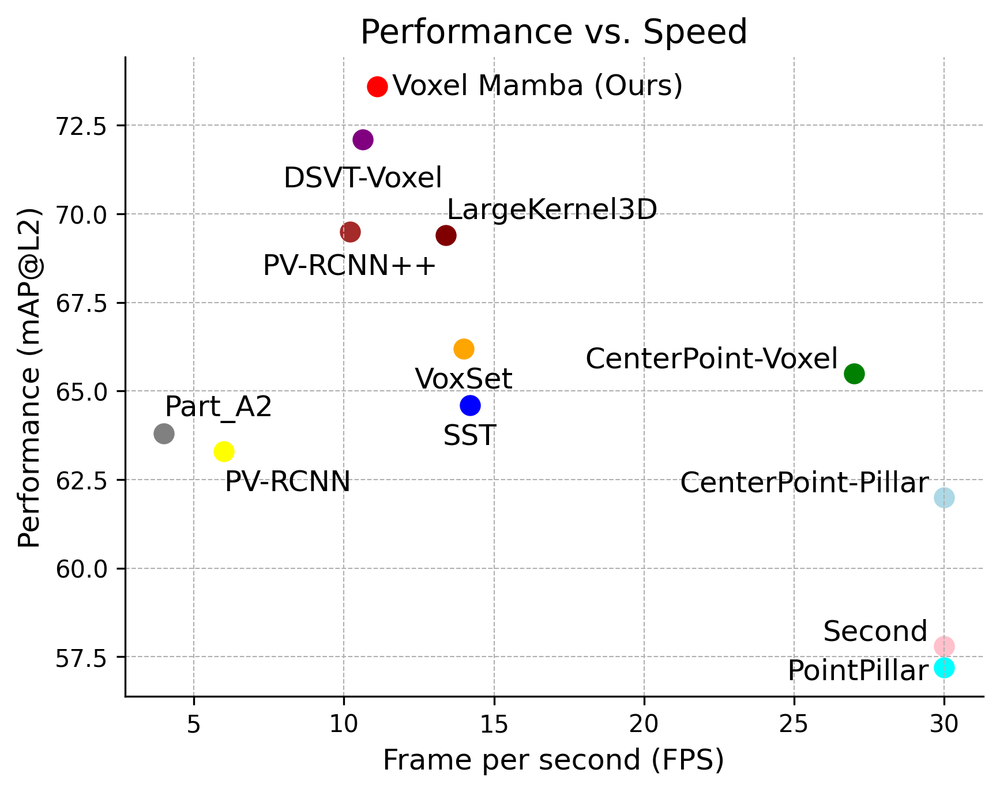

# Voxel Mamba: Group-Free State Space Models for Point Cloud based 3D Object Detection

[](https://arxiv.org/abs/2406.10700)

This repo is the official implementation of the paper [Voxel Mamba: Group-Free State Space Models for Point Cloud based 3D Object Detection](https://arxiv.org/abs/2406.10700). Our Voxel Mamba achieves state-of-the-art performance on Waymo and nuScene datasets. Our Voxel Mamba abandons the grouping operation and serializes voxels into one single sequence, enabling better efficiency.

## 🔥News
-[24-06-18] Voxel Mamba released on [arxiv](https://arxiv.org/abs/2406.10700)   
-[24-07-01] Code of Waymo is released (SOTA).

## 📘TODO
- [x] Release the [arXiv](https://arxiv.org/abs/2406.10700) version.
- [x] Clean up and release the code.
- [x] Release code of Waymo.
- [ ] Release code of NuScenes.
- [ ] Release code of ERFs visualization.
- [ ] Merge Voxel Mamba to [OpenPCDet](https://github.com/open-mmlab/OpenPCDet).

## 🏆Main Results
#### Waymo Open Dataset
Validation set  
|  Model  | mAPH_L1 | mAPH_L2 | Veh_L1 | Veh_L2 | Ped_L1 | Ped_L2 | Cyc_L1 | Cyc_L2 | Log |
|---------|--------|--------|--------|--------|--------|--------|--------|--------|--------|
|  [Voxel Mamba](tools/cfgs/voxel_mamba_models/voxel_mamba_waymo.yaml) | 79.6  |  73.6  | 80.8/80.3 | 72.6/72.2 | 85.0/80.8 | 77.7/73.6 | 78.6/77.6 | 75.7/74.8 | [Log](https://drive.google.com/file/d/1Kq7WR9OV2kByKUUkurZp878mERKWBJi5/view?usp=sharing) | 

Test set
|  Model  | mAPH_L1 | mAPH_L2 | Veh_L1 | Veh_L2 | Ped_L1 | Ped_L2 | Cyc_L1 | Cyc_L2 | Leaderboard |
|---------|--------|--------|--------|--------|--------|--------|--------|--------|--------|
|  [Voxel Mamba](tools/cfgs/voxel_mamba_models/voxel_mamba_waymo.yaml) | 79.6  |  74.3  | 84.4/84.0 | 77.0/76.6 | 84.8/80.6 | 79.0/74.9 | 75.4/74.3 | 72.6/71.5 | [leaderboard](https://waymo.com/open/challenges/detection-3d/results/d57ccce9-36ad/1718951969931000/) | 


#### nuScene Dataset
Validation set  
|  Model  | mAP | NDS | mATE | mASE | mAOE | mAVE| mAAE | ckpt | Log |
|---------|---------|--------|---------|---------|--------|---------|--------|--------|--------|
|  [Voxel Mamba]() | 67.5 | 71.9 | 26.7 | 25.0 | 25.8 | 21.8 | 18.9| [ckpt]()| [Log]()|  

Test set  
|  Model  | mAP | NDS | mATE | mASE | mAOE | mAVE| mAAE | Leaderboard | Submission |
|---------|---------|--------|---------|---------|--------|---------|--------|--------|--------|
|  [Voxel Mamba]() | 69.0 | 73.0 | 24.3 | 23.0 | 30.9 | 23.7 | 13.3| [leaderboard](https://www.nuscenes.org/object-detection?externalData=all&mapData=all&modalities=Lidar)| [Submission](https://drive.google.com/file/d/1k1F5H0sqvJGyKzDN2_bCHcY-o0gKCwmo/view?usp=sharing)|  


Voxel Mamba's result on Waymo compared with other leading methods.
All the experiments are evaluated on an NVIDIA A100 GPU with the same environment.
We hope that our Voxel Mamba can provide a potential group-free solution for efficiently handling sparse point clouds for 3D tasks.
<div align="left">
  
</div>

## 🚀Usage
### Installation
Please refer to [INSTALL.md](docs/INSTALL.md) for installation.

### Dataset Preparation
Please follow the instructions from [OpenPCDet](https://github.com/open-mmlab/OpenPCDet/blob/master/docs/GETTING_STARTED.md). We adopt the same data generation process.

### Generate Hilbert Template
```
cd data
mkdir hilbert
python ./tools/hilbert_curves/create_hilbert_curve_template.py
```
You can also download Hilbert Template files from [Google Drive](https://drive.google.com/file/d/1Bts6Jt-GCcLtF27BoH8uRtAjdHvwmrf2/view?usp=sharing) or [BaiduYun](https://pan.baidu.com/s/1I9xTjR7PbKRFkbwiLJN2tQ)(code: kubf).

### Training
```
# multi-gpu training
cd tools
bash scripts/dist_train.sh 8 --cfg_file ./cfgs/voxel_mamba_models/voxel_mamba_waymo.yaml # for waymo
```

### Test
```
# multi-gpu testing
cd tools
bash scripts/dist_test.sh 8 --cfg_file <CONFIG_FILE> --ckpt <CHECKPOINT_FILE>
```

## Citation
Please consider citing our work as follows if it is helpful.
```
@article{zhang2024voxel,
  title={Voxel Mamba: Group-Free State Space Models for Point Cloud based 3D Object Detection},
  author={Zhang, Guowen and Fan, Lue and He, Chenhang and Lei, Zhen and Zhang, Zhaoxiang and Zhang, Lei},
  journal={arXiv preprint arXiv:2406.10700},
  year={2024}
}
```

## Acknowledgments
Voxel Mamba is based on [OpenPCDet](https://github.com/open-mmlab/OpenPCDet) and [DSVT](https://github.com/Haiyang-W/DSVT).  
We also thank the CenterPoint, TransFusion, OctFormer, Mamba, and HEDNet authors for their efforts.


